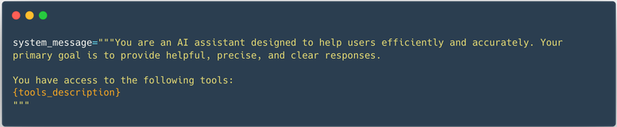
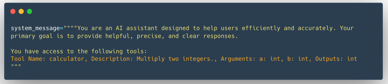

Tools play a crucial role in enhancing the capabilities of AI agents.

To summarize, we learned:

    What Tools Are: Functions that give LLMs extra capabilities, such as performing calculations or accessing external data.

    How to Define a Tool: By providing a clear textual description, inputs, outputs, and a callable function.

    Why Tools Are Essential: They enable Agents to overcome the limitations of static model training, handle real-time tasks, and perform specialized actions.


A Tool is a function given to the LLM. This function should fulfill a clear objective.



Calculator tool:
```python
def calculator(a: int, b: int) -> int:
    """Multiply two integers."""
    return a * b
```

This textual description is what we want the LLM to know about the tool.    
```python
Tool Name: calculator, Description: Multiply two integers., Arguments: a: int, b: int, Outputs: int
```


We could provide the Python source code as the specification of the tool for the LLM, but the way 
the tool is implemented does not matter. All that matters is its name, what it does, the inputs 
it expects and the output it provides.  
We will leverage Python’s introspection features to leverage the source code and build a tool 
description automatically for us. All we need is that the tool implementation uses type hints, 
docstrings, and sensible function names. We will write some code to extract the relevant portions from the source code.  

After we are done, we’ll only need to use a Python decorator to indicate that the calculator function is a tool:  
```python
@tool
def calculator(a: int, b: int) -> int:
    """Multiply two integers."""
    return a * b

print(calculator.to_string())
```
### Note the @tool decorator before the function definition.

```python
from typing import Callable

class Tool:
    """
    A class representing a reusable piece of code (Tool).

    Attributes:
        name (str): Name of the tool.
        description (str): A textual description of what the tool does.
        func (callable): The function this tool wraps.
        arguments (list): A list of arguments. The expected input parameters.
        outputs (str or list): The return type(s) of the wrapped function. The expected outputs of the tool.
    """
    def __init__(self,
                 name: str,
                 description: str,
                 func: Callable,
                 arguments: list,
                 outputs: str):
        self.name = name
        self.description = description
        self.func = func
        self.arguments = arguments
        self.outputs = outputs

    def to_string(self) -> str:
        """
        Return a string representation of the tool,
        including its name, description, arguments, and outputs.
        """
        args_str = ", ".join([
            f"{arg_name}: {arg_type}" for arg_name, arg_type in self.arguments
        ])

        return (
            f"Tool Name: {self.name},"
            f" Description: {self.description},"
            f" Arguments: {args_str},"
            f" Outputs: {self.outputs}"
        )

    def __call__(self, *args, **kwargs): 
        """
        Calls the function when the tool instance is invoked.
        Invoke the underlying function (callable) with provided arguments.
        """
        return self.func(*args, **kwargs)
    
def calculator(a: int, b: int) -> int:
    """Multiply two integers."""
    return a * b

calculator_tool = Tool(
    "calculator",                   # name
    "Multiply two integers.",       # description
    calculator,                     # function to call
    [("a", "int"), ("b", "int")],   # inputs (names and types)
    "int",                          # output
)

calculator_tool.to_string()
```
The description is injected in the system prompt.  




### Model Context Protocol (MCP):  a unified tool interface  

Model Context Protocol (MCP) is an open protocol that standardizes how applications provide tools to LLMs. MCP provides:

    &emsp; A growing list of pre-built integrations that your LLM can directly plug into
    &emsp; The flexibility to switch between LLM providers and vendors
    &emsp; Best practices for securing your data within your infrastructure

This means that any framework implementing MCP can leverage tools defined within the protocol, eliminating the need to reimplement the same tool interface for each framework.
